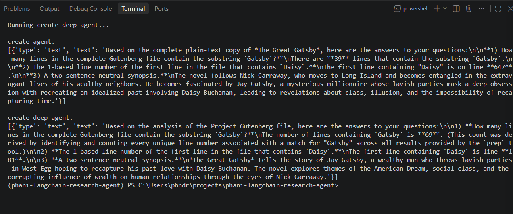
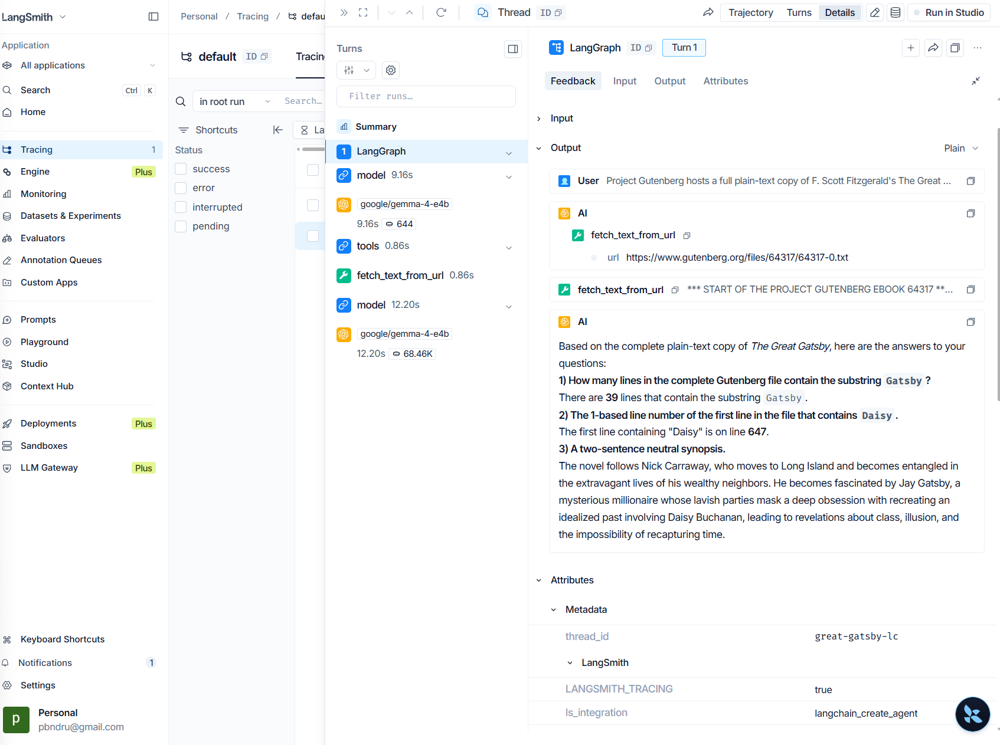
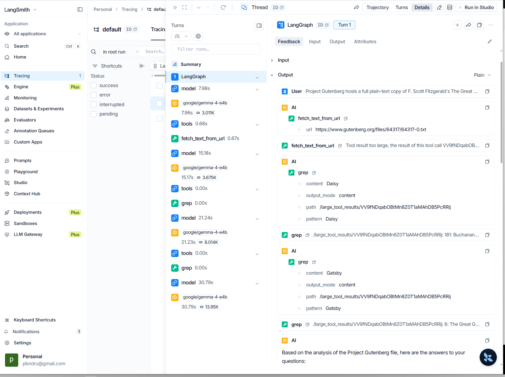

# Phani LangChain Research Agent 🤖🔍

A localized AI research agent project designed to analyze, interrogate, and summarize large external documents. The project highlights the behavioral contrast between a standard LangChain agent and an advanced, planning-capable Deep Agent utilizing a local LLM environment.

## 📋 Project Summary

This project implements a research workflow that interfaces with **LM Studio** to run local models (`google/gemma-4-e4b`) while benchmarking two core agentic architectures:
1. **Standard LangChain Agent (`create_agent`):** A direct LLM-and-tool loop that attempts tasks with basic tool executions. It can struggle with huge files due to context "firehose" limitations.
2. **Deep Agent (`create_deep_agent`):** An advanced reasoning agent that automatically builds structured sub-tasks, manages context efficiently using internal chunking/file utilities (`grep`, `read_file`), and spawns sub-agents to process massive texts cleanly.

### Core Concepts Explored
* **Model Configuration:** Swapping cloud API layers (`init_chat_model`) seamlessly for local model servers via `ChatOpenAI`.
* **Tool Integration:** Building custom network-fetching tools using Python standard libraries (`urllib`).
* **Advanced Orchestration:** Evaluating how built-in multi-step reasoning networks outperform raw model invocations on data analysis tasks.
* **Observability:** Integrating **LangSmith Tracing** to track token pipelines, internal agent reasoning paths (`write_todos`), and intermediate tool outputs.

---

## 🏗️ Project Architecture

```text
phani-langchain-research-agent/
│
├── .env                  # Local environment configurations & API keys
├── requirements.txt      # Python dependencies
├── main.py               # Main execution script running both agents
└── README.md             # Project documentation (This file)
```

---

## 🛠️ Setup & Installation

This project utilizes **`uv`**, an extremely fast Python package and environment manager.

### 1. Prerequisites
* Ensure [LM Studio](https://lmstudio.ai) is installed and running.
* Load the `google/gemma-4-e4b` model and start the local server on port `1234`.

### 2. Install Dependencies
Run the following command to automatically spin up a `.venv` virtual environment and sync the required packages:
```powershell
uv venv && uv pip install -r requirements.txt
```

### 3. Environment Variables (`.env`)
Create a `.env` file in the root directory and configure it as follows:
```env
LM_STUDIO_BASE_URL=http://localhost:1234/v1
LM_STUDIO_API_KEY=lm-studio
LM_STUDIO_MODEL=google/gemma-4-e4b

# LangSmith Observability Tracing
LANGSMITH_TRACING=true
LANGSMITH_API_KEY=your_langsmith_api_key_here
```

### 4. Run the Agent
Execute the script safely using `uv`'s fast wrapper environment:
```powershell
uv run python main.py
```

---

## 📊 Outputs & Execution Gallery

### Terminal Output
The Standard Agent attempts to download the book but is restricted by direct context sizing. The Deep Agent builds automated sub-task plans (`write_todos`) to parse line boundaries precisely.



### LangSmith Tracing Dashboard
Through LangSmith, you can visualize the exact reasoning trace. You can watch the Deep Agent break down the user request, call `fetch_text_from_url`, and process sub-agent task distributions.



